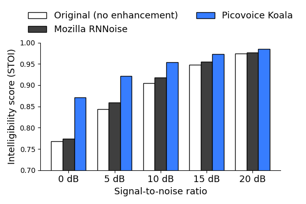

# Noise Suppression Benchmark

Made in Vancouver, Canada by [Picovoice](https://picovoice.ai)

This repo is a minimalist and extensible framework for benchmarking different noise suppression engines on 16kHz 
monaural speech data across varying signal-to-noise ratios.

## Table of Contents

- [Data](#data)
- [Metrics](#metrics)
- [Engines](#engines)
- [Usage](#usage)
- [Results](#results)

## Data

The only currently implemented data set is the `synthetic, no reverb` part of the test set of the first installment of 
the Microsoft deep noise suppression challenge at Interspeech 2020. It consists of 150 noisy files across various SNR 
levels as well as their clean reference files. The data is available 
[here](https://github.com/microsoft/DNS-Challenge/tree/interspeech2020/master/datasets/test_set/synthetic/no_reverb)
within Microsoft's [DNS-Challenge repository](https://github.com/microsoft/DNS-Challenge).

Either clone the whole repo and switch to the `interspeech2020/master` branch, or run the following commands in a new 
directory to sparsely checkout the required files:
```console
git init
git remote add -f origin git@github.com:microsoft/DNS-Challenge.git
git sparse-checkout init
git switch interspeech2020/master
git sparse-checkout set datasets/test_set/synthetic/no_reverb LICENSE README.md
```

The `--data-folder` argument required for this benchmark needs to be set to
`/PATH/TO/DNS-Challenge/datasets/test_set/synthetic/no_reverb`


## Metrics

### Short-Term Objective Intelligibility (STOI)

The STOI metric is a simple intrusive metric that quantifies the similarity between the denoising output and the clean
reference. The metric is a value between 0 and 1, where 1 means that the denoising result is exactly equal to the
reference.

### Real Time Factor

Real-time factor (RTF) is the ratio of CPU (processing) time to the length of the input speech file. A speech-to-text
engine with lower RTF is more computationally efficient.

## Engines

- [Mozilla RNNoise](https://gitlab.xiph.org/xiph/rnnoise/)
- [Picovoice Koala](https://picovoice.ai/)

## Usage

This benchmark has been developed and tested on `Ubuntu 20.04` using `Python 3.8`.

- Install [FFmpeg](https://www.ffmpeg.org/)
- Download the data
- Install the requirements:

```console
pip3 install -r requirements.txt
```

In the following commands, replace `${DATASET}` with one of the supported datasets and `${DATA_FOLDER}` with the path
to the dataset folder. See [Data](#data) for details.

### Remix at a specific SNR

In order to remix the dataset at a specific signal-to-noise ratio (SNR), add `--remix-snr-db ${SNR_DB}` to the
arguments to `python3 benchmark.py` and replace `${SNR_DB}` with your SNR in dB.

The mixer separates the clean data from the noise, scales the noise, and mixes them together again. The scaling is done
in such a way that
$$ \frac{\mathrm{power}(\mathrm{clean})}{\mathrm{power}(\mathrm{noise})} = 10^{\mathrm{SNR_DB} / 10}. $$
To compute the $\mathrm{power}$ of a signal, we divide it into frames of 512 samples and take the sum of squared samples
in each frame. The $\mathrm{power}$ is then defined as the maximum frame-wise sum of squares in any frame.

### Mozilla RNNoise Instructions

Clone the RNNoise repository from [https://gitlab.xiph.org/xiph/rnnoise](https://gitlab.xiph.org/xiph/rnnoise) 
and follow the build instructions. Then run the following command, replacing `${RNNOISE_FOLDER}` with the path to the
root folder of the RNNoise repository.

```console
python3 benchmark.py \
--engine mozilla_rnnoise \
--dataset ${DATASET} \
--data-folder ${DATA_FOLDER} \
--rnnoise-demo-path ${RNNOISE_FOLDER}/examples/rnnoise_demo
```

Note that since RNNoise operates at 48kHz, this benchmark internally resamples the audio.

### Picovoice Koala Instructions

Replace `${DATASET}` with one of the supported datasets, `${DATASET_FOLDER}` with path to dataset, and
`${PICOVOICE_ACCESS_KEY}` with AccessKey obtained from [Picovoice Console](https://console.picovoice.ai/).

```console
python3 benchmark.py \
--engine picovoice_koala \
--dataset ${DATASET} \
--data-folder ${DATA_FOLDER} \
--picovoice-access-key ${PICOVOICE_ACCESS_KEY}
```

## Results

### STOI



|     Engine      | Interspeech2020 |
|:---------------:|:---------------:|
| Mozilla RNNoise |      0.925      |
| Picovoice Koala |      0.959      |

### RTF

Measurement is carried on an Ubuntu 20.04 machine with Intel CPU (`Intel(R) Core(TM) i5-9400F CPU @ 2.90GHz`), 64 GB of
RAM, and NVMe storage.

|     Engine      | RTF  |
|:---------------:|:----:|
| Mozilla RNNoise | 0.02 |
| Picovoice Koala | 0.03 |
